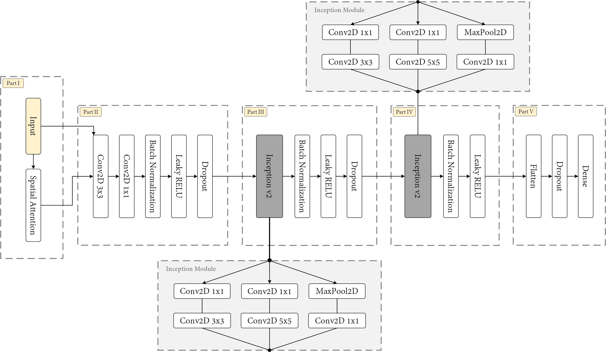

# Deep Learning classification of hyperspectral UAV swaths

 
 
 


This repository contains additional material from the paper titled 'Classification of vineyard varieties with UAV hyperspectral imaging'. It contains the source code, the trained networks in `.h5` file format and some brief concepts for anyone wondering how to make this project work.


# Requirements

The large list of requirements is placed under `pip3`, along with the used version. It is recommended to start from a clean project and use the `requirements.txt` as input for `pip3`. Also, note that we have used CUDA and CuNN to fasten the training of the proposed network. Nevertheless, it should also work without these components in your computer. However, we are trying to link with CuNN at the start of the training, so a warning is the least you can expect without it.

# Trained networks

These are under the `trained_networks` folder, one for each grapevine variety (either red or white). Note that these use some custom layers, and therefore, these must be specified in the loading.

```# Load network
network_file = os.path.join(paths.result_folder + 'trained_networks/', network_name + ".h5")
model = keras.models.load_model(network_file, custom_objects=           
    {'SpatialAttention': papers.aspn.SpatialAttention, 
     'SecondOrderPooling': papers.aspn.SecondOrderPooling})
```

This operation loads both the underlying CNN architecture and its weights. You can check the loaded network by plotting it in a graph. It should be something similar to the following image:



```
if show_summary:
    model.summary()

if render_image:
    tf.keras.utils.plot_model(model, to_file=paths.result_folder + 'summary/' 
                                + model_name + '.png', show_shapes=True, 
                                show_layer_names=False)
```

# Datasets

If these are required, please contact allopezr@ujaen.es and they will be provided if the petition is properly justified. 

# Training 

Please, use the `.py` files under `training` folder as the entry point of the training phase. These files load the hypercubes, split them into patches and execute several tests that are averaged and saved in the file system. Nevertheless, averaged results, together with the variability, will be displayed at the end of the training.

# Configuration

This repository contains a non-updated `config.py` with the experimental settings for every compared network. However, we rather recommend `config.json`, since it has a higher priority. Note that we had some reloading troubles with python files in Jupyter notebooks, and therefore, a JSON file was used over the first one. The `config.py` is loaded, and then, `config.json` overrides the content of the variables as defined in the python file.

## Which parameters are supported?

Parameters not related to a specific network:
* batch_size: 512
* epochs: 100
* loss: sparse_categorical_crossentropy
* last_activation: softmax
* patch_size: 23
* patch_overlapping: 22
* test_split: 0.3
* validation_split: 0.1

Others that can be specified for an individual network: 

* intermediate_activation: relu
* kernel_size: 3
* start_size: 16 (it is the baseline for convolutional layers). For instance, CNNs are parameterized as follows:
    ```
    x = Conv2D(start_size * 1, 1, strides=1, padding="same")(x)
    x = Conv2D(start_size * 1, kernel_size, strides=strides, padding="same")(x)
    ```
    This is typically adjusted as $2^x$ to be upscaled or downscaled if underfitting or overfitting is observed.
* strides: 2
* optimizer: rmsprop
* learning_rate: 0.0001
* patch_size: 23
* patch_overlapping: 22
* momentum: 0.9 (SGD optimizer)

Note that the patch size should be an odd number, whereas overlapping must be lower than the patch size. It is similar to the concept of striding in CNNs. It is easier to integrate more parameters if required, simply modify the file `cnn_builder.py`.

# Results

The following images depict the confusion matrices and separability of the proposed network.


# Acknowledgments

This result has been partially supported by the Spanish Ministry of Science, Innovation and Universities via a doctoral grant to the first author (FPU19/00100), as well as a grant for researching at the University of Trás-os Montes e Alto Douro (EST22/00350).


